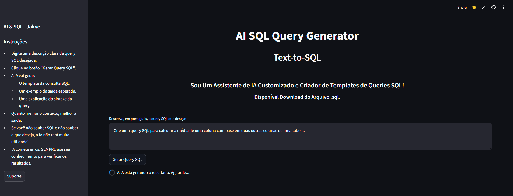

# 🧠 Text_to_SQL

Este projeto tem como objetivo converter linguagem natural (texto em português) em comandos SQL, permitindo que usuários interajam com bancos de dados sem escrever manualmente consultas SQL.

## ✨ Funcionalidades

- Tradução de perguntas em português para SQL
- Compatível com diversos bancos de dados relacionais
- Interface intuitiva (CLI ou web)


## 🛠 Tecnologias Utilizadas

- Python 3.x
- Google Generative AI -> genai 
- Streamlit (interface web opcional)



## 🚀 Instalação

Clone o repositório e instale as dependências:

```bash
git clone https://github.com/jaquelinesfernandes/Text_to_SQL.git
cd Text_to_SQL

pip install -r requirements.txt
